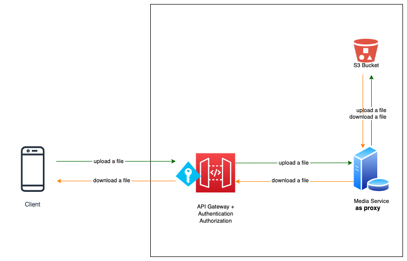
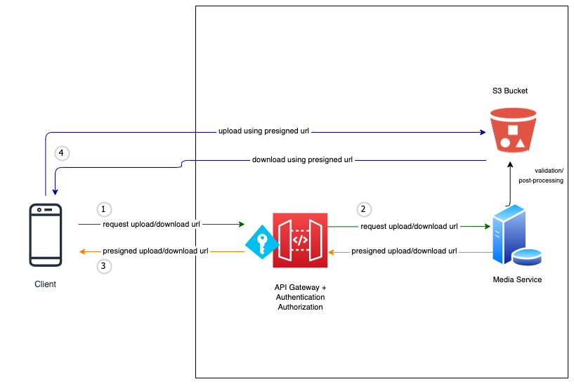

# Notes: Amazon Simple Storage Service (S3)

There are three possible ways to access/manage S3 and its objects
1. AWS Management console https://s3.console.aws.amazon.com/s3/
1. AWS Command Line Interface (CLI)
1. Using SDKs
#### 1. [AWS Management Console](https://s3.console.aws.amazon.com/s3/)

-  Using the Web Console, we can perform S3 operations (i.e. browse a bucket, upload an object, download an object, update object permissions and metadata, ...). Best option for administrators, or any users who prefer to use a graphical interface.

#### 2. [AWS CLI](https://docs.aws.amazon.com/polly/latest/dg/setup-aws-cli.html)

- If we want to use terminal/command-prompt instead, we can use *AWS CLI*. This is the best option if we want to download or upload in bulk (something we cannot do with the Web Console). We can sync a local folder to the destination bucket and vice versa.

- Checkout my cheat sheet for Mac [here](https://gist.github.com/cereblanco/5d1dc6687d426d644c02141d0de90ef0).

#### 3. Using SDKs

- If we want to use S3 in our *application/software*, we can use *SDK*s. Best option for *automating* pre-processing/post-processing of the objects in S3. Operative word is *automate*.

  - python -> [boto3](https://github.com/boto/boto3)
  - javascript -> [aws-sdk-js](https://github.com/aws/aws-sdk-js)

  **The use case for PresignedURLs**

  - If we want to allow third parties to have temporary access to an S3 object, the best option would be to use [Pre-signed URLs](https://boto3.amazonaws.com/v1/documentation/api/latest/guide/s3-presigned-urls.html). With presigned URLs, clients can directly talk to S3 instead of talking to our media service and our media service relaying the requests to S3.

  - For instance, in our illustration below, all requests from the client pass through our media service, and our media service talks to S3 on client's behalf. This flow spawns heavy load on our media service; imagine all the files that will pass through it and the resources (network bandwidth, memory/cpu usage, ...) it must sustain to support upload and download operations.

  **WITHOUT Pre-signed URLs**

    

  - The use of presigned URLs resolves this issue. As illustrated below, the client requests for upload URL then the media service responds with a presigned upload url. The client can then use this presigned url to upload a file on S3. Downloading a file follows the same flow.

  **WITH Pre-signed URLs**

    

  - We can use **SDKs** or **AWS CLI** to generate presigned-urls.
  
  - 
    > IMPORTANT!
    > - Presigned urls have life spans.
    > - The client can only use them before they expire.

  - Here's a snippet using `boto3`

    ```python
    import logging
    from typing import Optional

    import boto3
    from botocore.exceptions import ClientError


    # Generate presigned url in our media service
    def generate_presigned_url(
            bucket_name: str, # name of the bucket
            object_key: str, # unique identifier of the object,
            expires_in: int, # ranges from 1 second to 604800 seconds
            content_type: Optional[str], # if not present, then the content-type is deduced from file extension
            download_filename: Optional[str], # if not present, the object key is used
    ) -> str:

        client = boto3.client(
            "s3",
            aws_access_key_id=AWS_ACCESS_KEY_ID,
            aws_secret_access_key=AWS_SECRET_ACCESS_KEY,
            'us-east-1',
        )
        try:
            upload_url = client.generate_presigned_url(
                ClientMethod="put_object", # `put_object` for upload, `get_object` for download
                Params={
                    "Bucket": bucket_name,
                    "Key": object_key,
                    # Uncomment to use optional parameters
                    # "ContentDisposition": f"attachment;filename={download_filename}",
                    "ContentType": content_type,
                },
                ExpiresIn=expires_in, 
                HttpMethod="put", 
            )
        except ClientError as e:
            logging.error(e)
            raise

        return upload_url
    ```

    ```python
    import requests

    # Upload a file using a presigned url in our client app
    with open('mountain.png', 'rb') as f:
        # You need to update the headers with the same `Params` you used in generating the presigned url
        headers = {'content-type': 'image/png','content-disposition': 'attachment;filename=new_filename_here.png' }
        result = requests.put(url, headers=headers, data=f)
        print(result, result.content)

    ```
