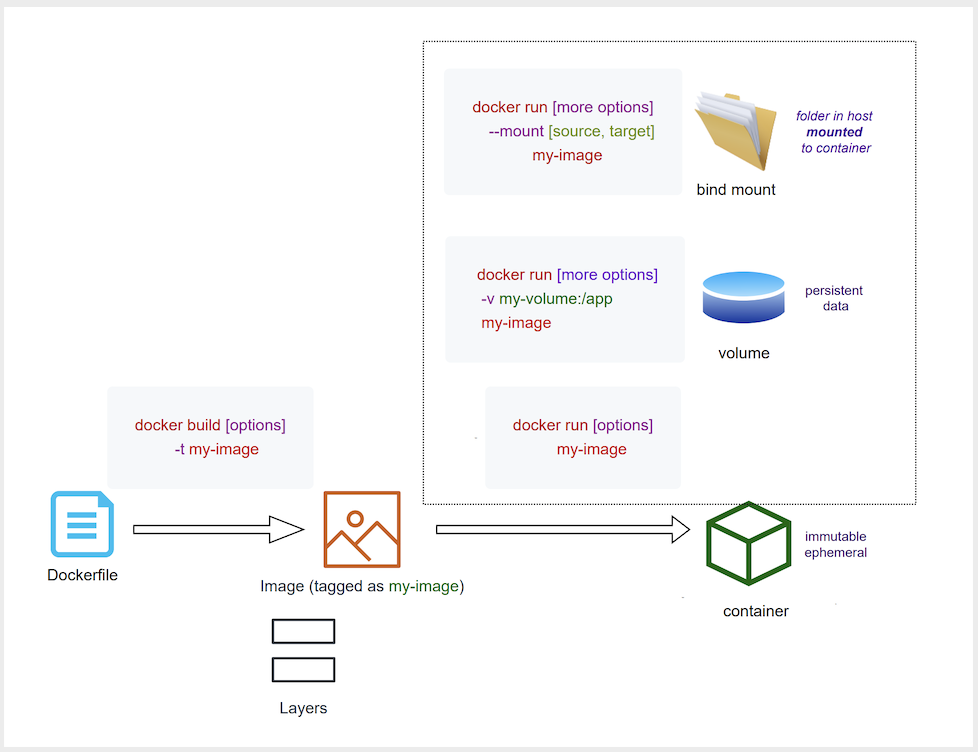

### Today I Learned: Docker

## Dockerfile
- Series of command-line instructions to assemble the docker image

## Docker Images
- A template/model that setups the environment and dependencies of the application as an isolated package
- It consists of a stack of layers; a layer is equivalent to a command-line instruction in Dockerfile
- `Layers` can be compared to `commits` in git (personal observation)
- Your machine downloads these `layers` in docker cache
- Only one copy of commit hash is downloaded and stored in docker cache. This saves up space in our host machine

### Docker tags

- Image **tag** is like a pointer to a specific layer in an image
- Tags are greatly used for versioning

## Tips when Building a Dockerfile

> Sequence of commands is important as each command represents a layer in docker cache; **place on top of the Dockerfile the commands that change the least, and at the bottom of the file the commands that change the most**

> Combine related and multiple commands in one layer. We use the `&&` to combine or chain one command after another. This saves time and space

## Docker Containers
- A running instance of an image
- `Containers` are immutable and ephemeral
- They don't change; thus if change is needed, dispose the current and just deploy a new one

## Volumes
- how about persistent data? We use `Volumes` and `Bind Mounts`
- volumes can outlive a container, this is good for persistent data such as `databases`

## Bind Mounting
- File sharing between a host and a Docker container
- Bind mount when you want a file or directory on the host machine to be mounted into a container
- As observed, we mount the source code of the application so the changes are immediately visible

## Docker Compose [WIP]
- Configure relationships between containers
- Configure multiple containers in one file
- YAML formatted;
- Example: https://github.com/cereblanco/todayilearned/blob/master/notes/docker-compose.yml
